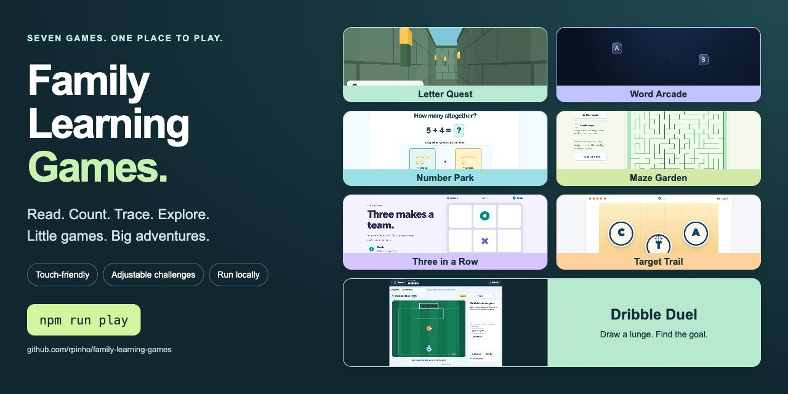
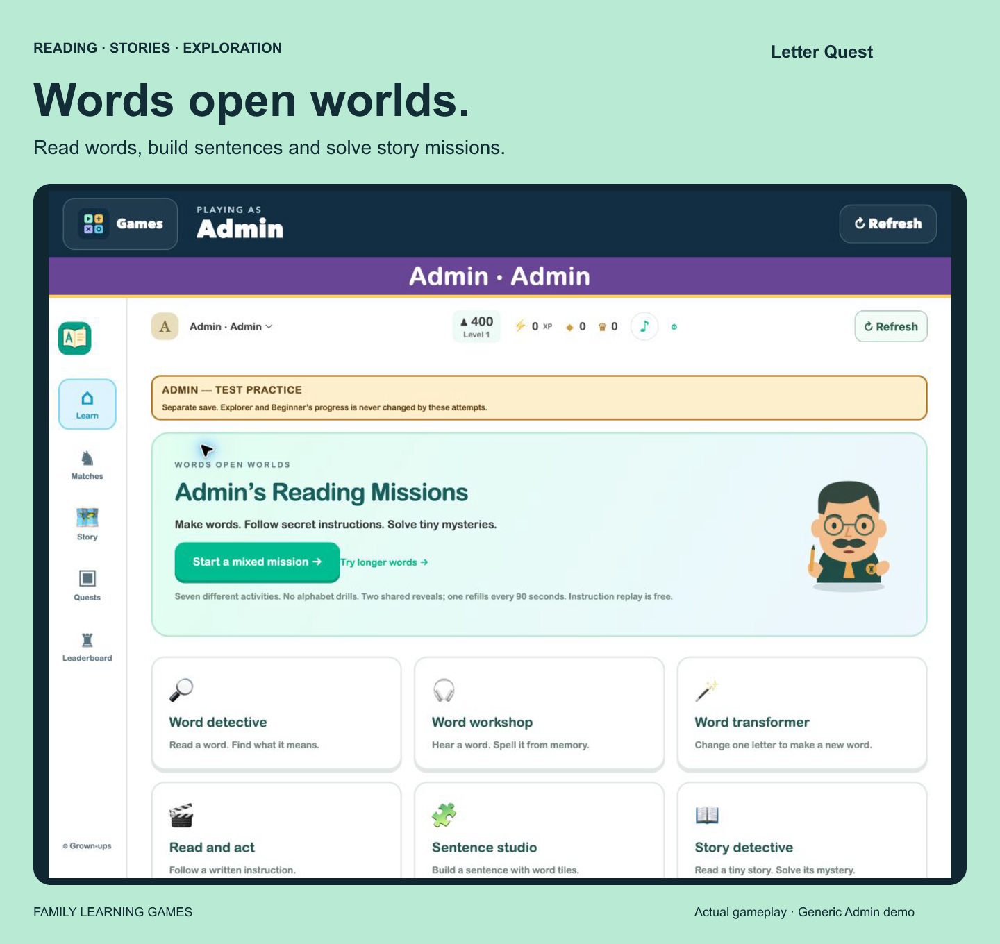
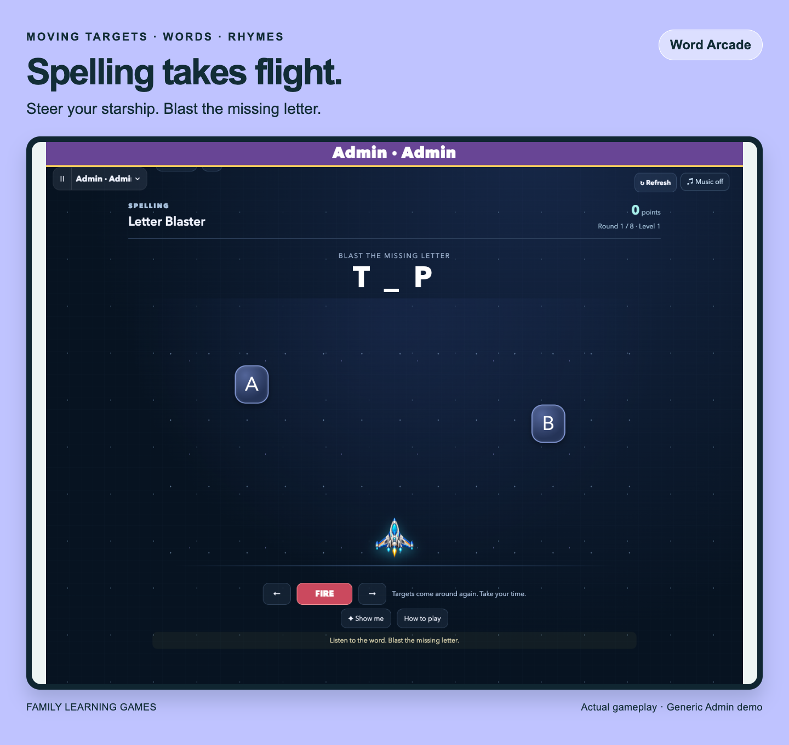
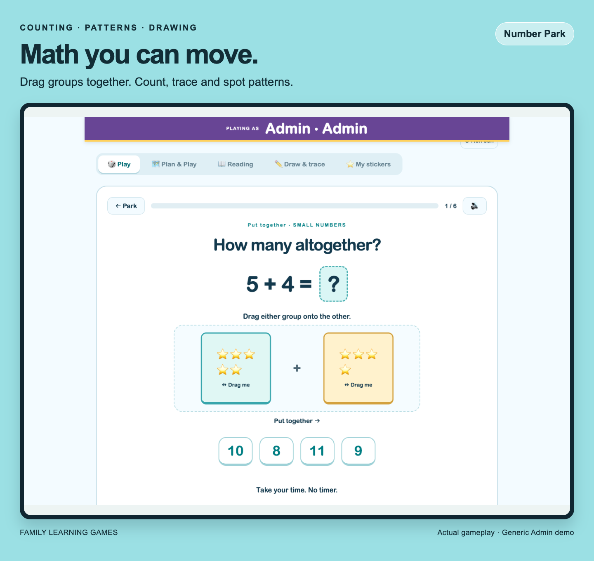
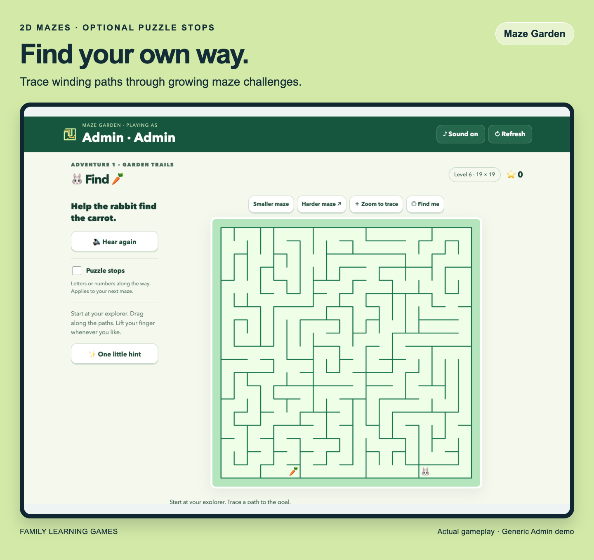
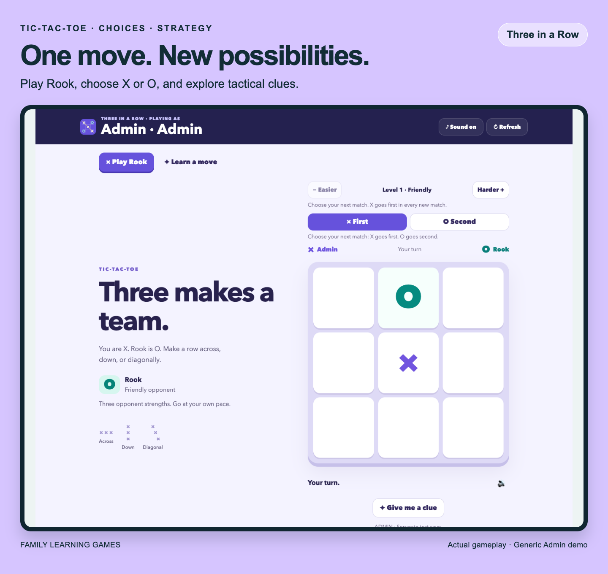
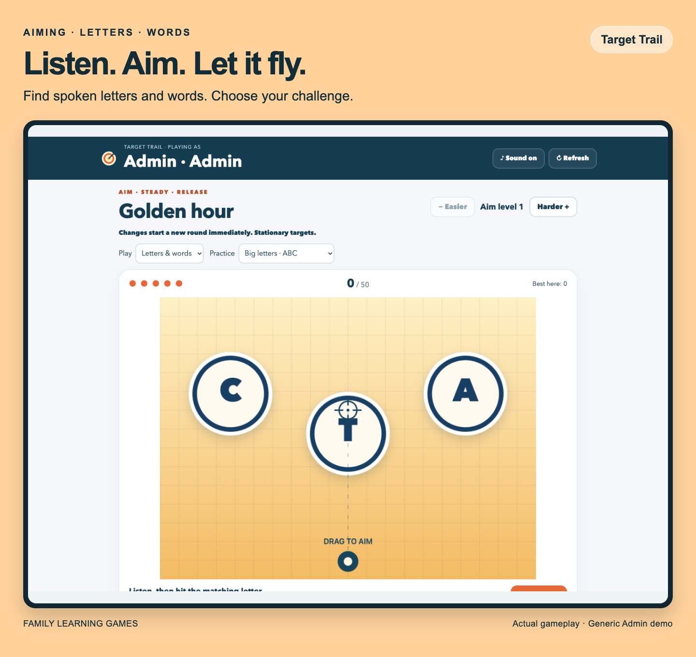
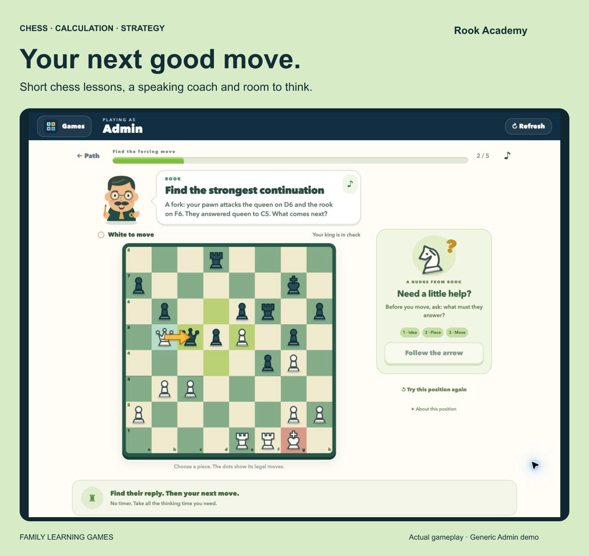
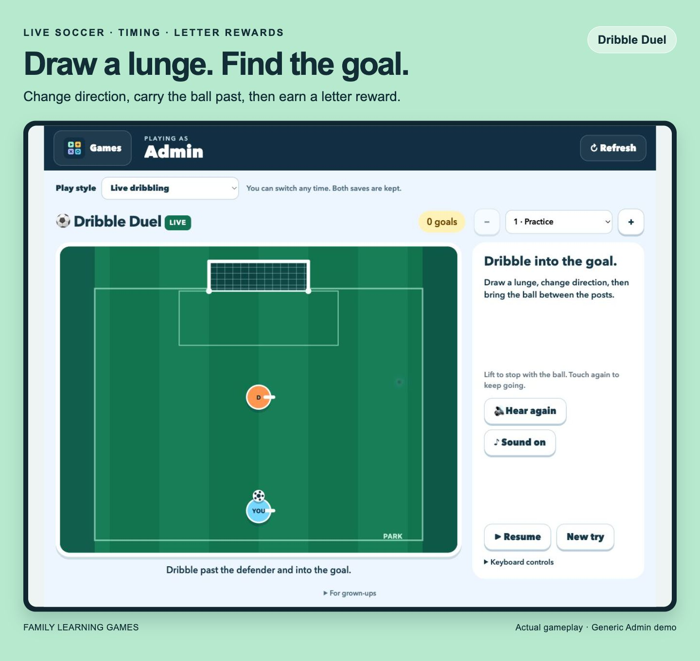

# Family Learning Games



**One app. Eight ways to play.** A single game-picker home screen brings together eight games for reading, numbers, drawing, mazes, chess, strategy, and soccer. Install the hub once, then switch games without another website. This is a **self-hosted source collection**, not a public online classroom or hosted play service.

After setup, open **http://localhost:4810/**. Choose a player once; their name stays large at the top and their progress stays separate. Use **Games** to return home, **Refresh** to reload, and **Grown-ups** to change the device's player or switch the main menu between gameplay screenshots and illustrated logos. The artwork choice is saved for that player on that device; activity-variant menus retain their gameplay previews. Main-menu order adapts per player from recent local play sessions, including older activities that now belong to Maze Garden or Soccer Club. It updates when opening the menu and stays still while choosing.

[Install in one command](#one-command-first-run) · [Let an agent install it](#let-a-coding-agent-install-it) · [Explore the games](#eight-games-eight-different-adventures) · [Privacy](PRIVACY.md)

## Eight games. Eight different adventures.

**[Rook Academy](hub/CHESS.md)** offers 18 First moves lessons, 54 Small steps lessons on sparse boards and a 72-lesson advanced continuation in two difficulty bands, an original speaking coach, hints, review and local practice games. **Maze Garden** now gathers all three maze variants, and **Soccer Club** gathers all three soccer variants. Choose any version; existing progress is preserved.

Drag, trace, steer, aim, and think ahead. Pick an activity and a manageable challenge, then play together.

<table>
<tr>
<td width="50%" valign="top">
<a href="games/letter-quest"></a>
<strong>Letter Quest — words open worlds.</strong><br>
Letter tracing, reading missions, word building and story adventures.
</td>
<td width="50%" valign="top">
<a href="games/word-arcade"></a>
<strong>Word Arcade — spelling takes flight.</strong><br>
Spaceship challenges, word building, rhyme hunts, sorting, and flashcards. Practice or Arcade pace.
</td>
</tr>
<tr>
<td width="50%" valign="top">
<a href="games/number-park"></a>
<strong>Number Park — math you can move.</strong><br>
Count objects, combine groups, take away, continue patterns, draw, trace, and explore reading or harder math.
</td>
<td width="50%" valign="top">
<a href="games/maze-garden"></a>
<strong>Maze Garden — find your own way.</strong><br>
Choose tracing mazes, the 3D letter labyrinth, or obstacle rescues. Each keeps its own progress.
</td>
</tr>
<tr>
<td width="50%" valign="top">
<a href="games/three-in-a-row"></a>
<strong>Three in a Row — think one move ahead.</strong><br>
Choose X or O, set the opponent's strength, play Rook, and explore one-move practice puzzles and tactical clues.
</td>
<td width="50%" valign="top">
<a href="games/target-trail"></a>
<strong>Target Trail — listen, aim, release.</strong><br>
Spoken letter and word targets with adjustable motion and aiming difficulty. Settings apply immediately.
</td>
</tr>
<tr>
<td width="50%" valign="top">
<a href="hub/CHESS.md"></a>
<strong>Rook Academy — your next good move.</strong><br>
Short tactical positions, a winding lesson path, a graduated short-lesson course, two advanced bands, review and practice games.
</td>
<td width="50%" valign="top">
<a href="hub/README.md#dribble-duel"></a>
<strong>Soccer Club — three ways to play.</strong><br>
Choose live dribbling, feint puzzles, or word penalties. Existing saves stay separate.
</td>
</tr>
</table>

*Actual gameplay from an isolated, generic Admin demo. Click a card for its game guide. No children's profiles or drawings are shown; screenshots are not evidence of learning outcomes.*

### Made for playing together

- **Touch-friendly:** drag objects, trace paths, steer a spaceship, and aim with a finger.
- **Choose the challenge:** separate Beginner and Explorer presets; adjustable or adaptive challenges vary by game.
- **Keep progress local:** saved rounds and diagnostics live on your own server. No ads or game-owned analytics.
- **One icon:** one installed home screen for all eight games; no separate installs needed.
- **Easy to start:** one setup command for the whole collection. No AI API key required.

## Pick a game

| Game | What is inside | Default local link |
| --- | --- | --- |
| [Letter Quest](games/letter-quest) | Letter tracing, reading practice and stories | http://localhost:4810/#letter-quest |
| [Word Arcade](games/word-arcade) | Moving spaceship challenges, word building, rhymes and flashcards | http://localhost:4810/#word-arcade |
| [Number Park](games/number-park) | Counting, patterns, manipulatives, drawing, reading and harder math | http://localhost:4810/#number-park |
| [Maze Garden](games/maze-garden) | Tracing mazes, 3D letter labyrinths and obstacle rescues | http://localhost:4810/#maze-garden |
| [Three in a Row](games/three-in-a-row) | Tic-tac-toe against Rook and one-move practice puzzles | http://localhost:4810/#three-in-a-row |
| [Target Trail](games/target-trail) | Moving targets, adjustable aiming difficulty and spoken letters/words | http://localhost:4810/#target-trail |
| [Rook Academy](hub/CHESS.md) | 144 lessons across beginner and advanced paths, review and local practice games | http://localhost:4810/#chess |
| [Soccer Club](hub/README.md#dribble-duel) | Live dribbling, feint puzzles and word penalties | http://localhost:4810/#dribble-duel |

## Run on your computer

### One-command first run

With **Node.js 22.13 or newer**, npm, and Git installed, paste this one command into Terminal (macOS/Linux) or PowerShell 7:

```sh
git clone https://github.com/rpinho/family-learning-games.git && cd family-learning-games && npm run play
```

This downloads the collection, installs locked dependencies, builds the two React interfaces, and starts the hub plus the game servers. The hub and other games need only Node. Open **http://localhost:4810/** in Chrome, Edge, or another modern browser. Keep the terminal running; Ctrl+C stops the servers. Later, run `npm start` in the same folder; no reinstall is necessary. An existing `family-learning-games` folder is not overwritten.

If you download the repository ZIP instead, unzip it, open a terminal in its folder, and run **`npm run play`**. Prerequisites are not silently installed and no administrator access is required by the game installer.

### Let a coding agent install it

Give your agent this request:

> Install and run https://github.com/rpinho/family-learning-games locally. Read its AGENTS.md and README first. Check Node/npm, use a new folder, run npm run play, verify all eight games through the hub, and give me the single home-screen link. Keep it private and preserve any existing saves.

[AGENTS.md](AGENTS.md) contains the installation, verification, data-preservation and privacy instructions. No API key or paid AI service is needed to run the games.

Choose **Beginner**, **Explorer**, or **Admin**. Add `/?player=beginner` or `/?player=explorer` to a link to open that preset. Beginner and Explorer have different starting challenges and separate saves; Admin is for testing. These are three shared presets per installation, not authenticated personal accounts. Spelling names in exercises are fictional examples.

To run just one game, run `npm start` inside its directory (for the React games, first run `npm ci` and `npm run build`). Individual servers use their original default ports, listed in their READMEs. Run `npm test` from the collection root after setup to check all game and hub suites.

## Play on a tablet or Chromebook

By default the servers accept connections only from the computer running them. For a **trusted private Wi-Fi network**, on macOS/Linux:

```sh
HOST=0.0.0.0 npm start
```

Then open `http://YOUR-COMPUTER-LAN-ADDRESS:4810/` on the child's device. On PowerShell, set `$env:HOST="0.0.0.0"` before `npm start`. Only the hub listens on the LAN; the game backends remain loopback-only. Allow the hub connection in your local firewall if necessary. Use your browser's Install/Create app action on **this home screen**, not on individual games. Parental approval may be needed once for this new address/port. Do **not** port-forward or expose these servers to the public internet. They do not have user authentication or internet-facing security hardening. A parent gate prevents accidental taps, not unauthorized access.

The apps include launcher icons and manifests. Installation/fullscreen behavior varies by browser; plain HTTP LAN addresses are not secure origins, so a seamless installable/offline experience is not guaranteed. GitHub Pages alone cannot run the Node save APIs.

## Privacy and saves

This release starts from fresh public history. It includes no real children's names, household logs, saved profiles, drawings, reports, contact details, credentials, or private deployment settings.

The launcher saves new local progress and diagnostics in **`.data/<game>/`**, which is ignored by Git. A game started individually uses its own directory under `~/.local/share/family-learning-games/`, unless its data environment variable is supplied. Never upload these data directories or attach raw logs/drawings to public issues. Save a backup before changing or removing local data.

Gameplay and drawing recognition run on your own server. There is no embedded API key, account requirement, advertising, chat, or third-party analytics. Browser narration may use a browser/vendor speech service; local voices are preferred when available, but offline speech is **not guaranteed**. See [PRIVACY.md](PRIVACY.md) and [SECURITY.md](SECURITY.md).

## Audio and learning limitations

Most games in the shared edition use device/browser narration instead of private voice caches. Voice quality and accent vary. **Rook Academy uses optional locally generated stock narration and stays text-only when clips are unavailable; it never falls back to device speech.** See its [audio setup](hub/CHESS.md). In Number Park Reading, the fallback says **letter names with example words**, not isolated phonemes: a grown-up should model the actual sounds and blending. It is not equivalent to a professionally recorded phonics course.

Word Arcade includes original synthesized music loops and CC0 laser effects. Private-use songs, third-party character recordings and extracted instructional audio are not included. [Third-party notices](THIRD_PARTY_NOTICES.md) document the included assets and drawing model.

These are experimental practice games, not validated educational assessments or medical/occupational-therapy tools. Scores, tracing success and engagement do not establish mastery or transfer to paper. Drawing guesses can be wrong. Play together, let the child choose a manageable challenge, and check skills away from the screen.

## Contributing and reuse

Bug reports should use an Admin preset with synthetic examples. Include the game, steps, browser and expected behavior; omit names and personal data. Run `npm run check:privacy` before publishing changes. The scanner is a guardrail, not proof that a change contains no private information.

A project-wide reuse license has not been selected yet; public visibility is not a blanket redistribution or commercial-use license. Third-party assets retain the licenses in their notices.
